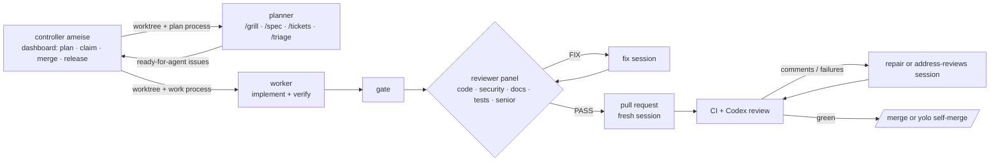

<picture>
  <source media="(prefers-color-scheme: dark)" srcset="docs/assets/banner-dark.png">
  
</picture>

# ameise

`ameise` is a local controller and Claude Code plugins for developers who let agents work their GitHub issues. It puts security first, then low token use, then throughput. Planning sessions turn ideas into agent-ready issues, and the controller claims each into an isolated worktree. A worker implements, an independent reviewer panel reviews, a fresh session opens the pull request, and CI and review comments are driven to green.



## What it ships
| Part | What it gives you | Runs where |
| --- | --- | --- |
| [controller](controller/README.md) | the program `ameise` and its [dashboard](dashboard/README.md): projects, plan, claim, merge, release | this machine, on a loopback address |
| [factory](factory/README.md) | a Go service that works routed issues unattended | a host of its own |
| [planner](plugins/planner/README.md) | `/grill`, `/spec`, `/tickets`, `/triage`, `/accept`, `/research`, `/prototype`, `/finish`; writes issues, never code | each planning worktree |
| [worker](plugins/worker/README.md) | the `worker` agent, the reviewer panel, `/hunt-tests`, `/docs` | each issue worktree |
| [repo-standards](plugins/repo-standards/README.md) | the six standardisation auditors, `/adr`, `/docs-check`; the templates and the check of the standard | any repository |

The factory is a peer of the local workflow and owns the delivery pipeline in Go. It shares no code with the controller. Its [readme](factory/README.md) covers running and releasing it, and the [runbook](docs/factory-runbook.md) covers a host.

## Install
The controller is one package with its dashboard and the three plugins. It needs Node 22+, Claude Code, git, `jq` and a logged-in `gh`. Install the tarball of the latest controller release from the [releases page](https://github.com/CalvinDittkrist/ameise/releases) by its URL:

```sh
npm install --global <tarball URL from the releases page>
ameise projects add ~/src/repo     # once ameise runs, or from the dashboard
```

The controller's sessions load the plugins it bundles. For sessions started by hand, install them from the marketplace `ameise`. They need Claude Code 2.1.270+, `gh`, `jq` and git; `npx gh-axi` and Codex as reviewer are optional.

```sh
claude plugin marketplace add CalvinDittkrist/ameise
claude plugin install worker@ameise
claude plugin install planner@ameise
claude plugin install repo-standards@ameise
```

## Daily use

```sh
ameise    # starts the controller and opens the dashboard on 127.0.0.1:7420
```

The board shows every project, its processes and the frontier of agent-ready issues. A click plans a topic, claims an issue in manual or yolo mode, merges a ready pull request, abandons a worktree or releases a milestone. A session's questions and permission prompts reach its process view; answer them there.

Bring each repository to the [standard](docs/repo-standard.md) once, with the [standardize process](controller/README.md#standardize-process) on its project page.

## Configuration
- The controller reads one file per machine, `~/.config/ameise/config.json`: its address, the quota check, notifications and projects.
- A repository sets its workflow knobs as `WF_*` variables under `env` in `.claude/settings.json`. The template is `plugins/repo-standards/templates/settings.json`.
- Repositories never override agents or skills locally; the standard check fails on them.

The [controller's readme](controller/README.md#configuration) documents the file and the knobs its stages and claims read. The plugin readmes of the [planner](plugins/planner/README.md#configuration), the [worker](plugins/worker/README.md#configuration) and [repo-standards](plugins/repo-standards/README.md#configuration) document theirs.

## Design
| Document | What it holds |
| --- | --- |
| [Vision](docs/vision.md) | why the repository exists and what it optimises for |
| [Architecture](docs/architecture.md) | the map of the parts and their boundaries |
| [Decisions](docs/adr/README.md) | the ADRs |
| [The local workflow, step by step](docs/local-workflow.md) | what happens from a plan to a release |
| [Security](docs/security.md) | the threat model and its boundaries |
| [Factory runbook](docs/factory-runbook.md) | a factory host's setup and upkeep |
| [Token budget](docs/token-budget.md) | what loads when |
| [Repository standard](docs/repo-standard.md) | the files every repository has, and the check |

## Develop

```sh
make check                            # the gate: everything CI runs
claude --plugin-dir plugins/worker    # try a plugin in a session without installing it
```

[AGENTS.md](AGENTS.md) holds everything else: the gate's parts, the fake runs, the conventions and the releases.

MIT licensed.
