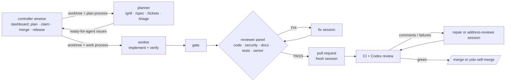

<picture>
  <source media="(prefers-color-scheme: dark)" srcset="docs/assets/banner-dark.png">
  
</picture>

# ameise

A local controller and Claude Code plugins for agent-driven development that put security first, then low token use, then throughput. Planning sessions turn ideas into agent-ready issues, each claimed into an isolated worktree. The controller runs each issue's sessions: a worker implements, an independent reviewer panel reviews, a fresh session opens the pull request, and CI and review comments are driven to green.

The local workflow is the controller `ameise`, one package with its dashboard and plugins. Beside it, `factory/` is a Go service that works routed issues unattended.



## Plugins

| Plugin | What it gives you | Runs where |
| --- | --- | --- |
| [planner](plugins/planner/README.md) | `/grill`, `/spec`, `/tickets`, `/triage`, `/accept`, `/research`, `/prototype`, `/finish`; writes issues through the controller's tools, never code | each planning worktree |
| [worker](plugins/worker/README.md) | the `worker` agent, the reviewer panel, `/hunt-tests`, `/docs` | each issue worktree |
| [repo-standards](plugins/repo-standards/README.md) | `/standardize`, `/apply`, `/adr`, `/docs-check`; the templates of the standard | any repository |

## Install

The [controller](controller/README.md) installs from its GitHub release, not yet from npm. It needs Node 22+, Claude Code, git, `jq` and a logged-in `gh`:

```sh
npm install --global https://github.com/CalvinDittkrist/ameise/releases/download/controller/v0.1.0/ameise-0.1.0.tgz
ameise                             # starts it and opens the dashboard on 127.0.0.1:7420
ameise projects add ~/src/repo     # then claim, plan, merge and release from the dashboard
```

The controller bundles the plugins. For sessions started by hand, they install from the marketplace `ameise` with Claude Code 2.1.270+, `gh`, `jq` and git. Optional: `npx gh-axi`, Codex as reviewer.

```sh
claude plugin marketplace add CalvinDittkrist/ameise
claude plugin install worker@ameise
claude plugin install planner@ameise
claude plugin install repo-standards@ameise
```

Once per repository, bring it to the [standard](docs/repo-standard.md):

1. `/repo-standards:standardize` runs six read-only auditors and records your approval per category.
2. `/repo-standards:apply` pushes a protected `pre-standard` tag, opens the catalogue issue and one cleanup pull request, and turns code findings into issues.
3. After the merge, `/repo-standards:apply` again configures the GitHub workspace and runs the check.

Teammates only run the install commands. Skills also install outside Claude Code: `npx skills add CalvinDittkrist/ameise --skill <name>`.

## Daily use

```sh
ameise    # the dashboard on 127.0.0.1:7420
```

The board shows every project, its processes and the frontier of agent-ready issues. A click plans a topic, claims an issue in manual or yolo mode, merges a ready pull request, abandons a worktree or releases a milestone. A session's questions and permission prompts reach its process view; answer them there. The [controller's readme](controller/README.md) documents its API and CLI.

## Configuration

Every knob is an environment variable in `.claude/settings.json` under `env`; the template is `plugins/repo-standards/templates/settings.json`. Repositories never override agents or skills locally; the standard check fails on them.

| Variable | Default | Meaning |
| --- | --- | --- |
| `WF_BASE_BRANCH` | remote default branch | base for worktrees and PRs |
| `WF_REVIEWERS` | `code,security,docs,tests,senior` | reviewer panel members |
| `WF_REVIEW_ROUNDS` | `3` | max review rounds |
| `WF_CI_REPAIR_ROUNDS` | `3` | max repair rounds per pull request, such as a round of address-reviews |
| `WF_PR_BOT_REVIEWERS` | `chatgpt-codex-connector` | bot logins whose review the worker waits for; `""` for none |
| `WF_PR_REVIEW_WAIT` | `1200` | seconds to wait for the bot's one review after checks pass |
| `WF_DOCS_TIMEOUT` | `30` | seconds one request of `claude-docs.sh` may take (`/worker:docs`) |
| `WF_PLANNER_LANGUAGE` | empty | conversation language of planner sessions, such as `german`; what the planner writes stays English |
| `WF_MODE`, `WF_ISSUE` | set by the controller's claim | per-session mode (`manual` or `yolo`) and issue |
| `WF_PLAN`, `WF_PLAN_ISSUE` | set by the controller's plan | per-session plan slug and planned issue |
| `WF_CONTROLLER` | set by the controller | marks a session the controller started; a skill that needs the controller reads it |
| `WF_PROJECT_TEMPLATE` | empty | `<owner>/<number>` of the project `workspace.sh --apply` copies into a repository without one |

A claim sets a worker knob for its one process; the [controller's readme](controller/README.md) names the knobs it accepts. The value wins per variable over the repository's settings ([settings](https://code.claude.com/docs/en/settings.md)).

A session takes its model from the first that is set:

1. the `model` of its agent file: `fable` for `planner`, `opus` for `worker`
2. `model` in your Claude Code settings

The planner runs on Fable. Neither it nor the worker sets an effort.

Every subagent with an agent file runs on `sonnet`: `high` effort for reviewers, auditors, the test hunter and docs lookup. The planner's research subagent follows its session.

## Design

- [Vision](docs/vision.md): why the repository exists and what it optimises for
- [Architecture](docs/architecture.md) and [ADRs](docs/adr/README.md)
- [The local workflow, step by step](docs/local-workflow.md)
- [Security](docs/security.md)
- [Factory host runbook](docs/factory-runbook.md): host setup and upkeep, and [the maintainer's list](docs/factory-runbook.md#the-maintainers-list) of the rename
- [Token budget: what loads when](docs/token-budget.md)
- [Repository standard](docs/repo-standard.md)

## Develop

```sh
make check                                        # the gate: shellcheck, plugin validate --strict, standard check, unit tests, Go vet/staticcheck/tests, the dashboard's lint, build and browser test
claude --plugin-dir plugins/worker                # try a plugin in a session without installing it
scripts/context-report.py                         # diagnostic: context and tool mix of finished worker sessions
make ui                                           # build the dashboard the factory binary embeds (a fresh clone has only a placeholder)
go -C factory run . -fake -config factory.json    # the factory on a canned queue: no tokens, no git, no GitHub
npm --prefix factory/ui run dev                   # the dashboard with hot reload, against a factory started beside it
```

The controller's build bundles the checkout's plugins, so its sessions run what the checkout holds. Tests run the real plugin scripts against the `gh` shim in `tests/shims/`.

- A plugin is released by bumping `version` in its manifest and running `scripts/release.sh <plugin> --push`.
- The controller: bump `version` in `controller/package.json` and run `scripts/release.sh controller --push` on `main`; CI attaches the package to its release.

`factory/` is the factory, a Go service and no plugin. It is a peer of the local workflow and owns the delivery pipeline in Go ([ADR 0038](docs/adr/0038-the-local-workflow-and-the-factory-are-peers.md), [ADR 0040](docs/adr/0040-the-factory-owns-the-delivery-lifecycle-in-go.md)).

- It claims the head of its line by creating the issue's branch on GitHub ([ADR 0024](docs/adr/0024-a-claim-is-the-creation-of-the-branch-through-the-api.md)).
- It runs the stages implement, gate, review, pr, ci, validate, merge and address-reviews in a worktree of its own clone, one headless session per step that needs judgement.
- Its sessions run on its own prompts with the plugins off, so a host needs Claude Code, `git`, `gh` and the binary ([ADR 0042](docs/adr/0042-the-factory-carries-its-own-prompts-and-updates-no-plugin.md)).
- Its read-only HTTP interface serves a dashboard built into the binary ([ADR 0033](docs/adr/0033-the-dashboard-is-built-into-the-factory-binary.md)).

Its configuration is in the [runbook](docs/factory-runbook.md#configuration). The facts a developer needs:

- `factory/factory.example.json` is a host's configuration and runs paused. A configuration without `paused` is paused, and `-paused` never unpauses one.
- A run on a developer's machine sets its own data directory, drops `"quota_axi"` and passes `-fake`.
- `"gate"` runs a command in the worktree, none, or hands the gate to CI through a draft pull request ([runbook](docs/factory-runbook.md#a-gate-on-ci)).
- `"quota_axi"` is the path of a pinned [quota-axi](https://github.com/kunchenguid/quota-axi), version 0.1.49. Below `"quota_minimum"`, default 12 %, nothing starts ([ADR 0037](docs/adr/0037-the-quota-check-waits-below-12-percent-of-the-workers-scope.md)).

The factory is released by bumping `factory/VERSION` and running `scripts/release.sh factory --push` on `main`. The `factory/v<version>` tag makes CI attach static linux binaries for amd64 and arm64 with checksums to a GitHub release. The dashboard needs Node; `make check` installs its dependencies and Chromium.

MIT licensed.
